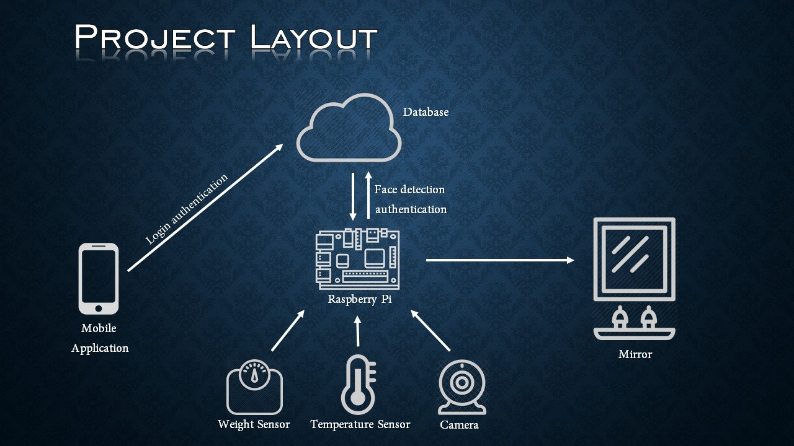

[comment]: # "This is the standard layout for the project, but you can clean this and use your own template"

# Smart Mirror

---

## Team
-  E/15/261, PERERA M.S.V., [vidurangaperera1@gmail.com](mailto:vidurangaperera1@gmail.com)
-  E/15/136, ILLANKOON H.M.A.U., [ajuillankoon@gmail.com](mailto:ajuillankoon@gmail.com)
-  E/15/292, RANASOORIYA S.M., [smadu1996@gmail.com](mailto:smadu1996@gmail.com)

## Table of Contents
1. [Introduction](#introduction)
2. [Solution Architecture](#solution-architecture )
3. [Hardware & Software Designs](#hardware-and-software-designs)
4. [Testing](#testing)
5. [Detailed budget](#detailed-budget)
6. [Conclusion](#conclusion)
7. [Links](#links)

---

## Introduction

People today are so busy with their day to day activities, so most of us forget many stuff that we are supposed to do. And we are not used of using a note book or a diary to write our activities but we really need a method so that we can remember our activities. But what ever we miss due to our busyness we will never forget something specially in the mornings. That's nothing but the mirror. Mirrors have been serving people from centuries. So can this tradition mirror remind us the things we have forgotten. Yes it can! That's nothing but by a smart mirror. No matter what your age is, no matter what your profession is, no matter how busy you are, you will stand in front of a mirror with or without intentionally. If a mirror can remind our daily activities, how nice it would be. With this no need of looking into diaries for daily plans, just have to look at the mirror as usual. Mirror will simply display your to-do list for the day. This is the main function of the Smart Mirror.  

A smart mirror has these following features.

- It will remind us with our to-do list
- It will display the date and time
- News headlines - Today’s people have no idea of what is going on. So this can deliver the current situation while sorting the news feeds according to the interest of the user. 
- Weather status - Knowing the weather forecast will help the user to manage his daily activities. So that will eliminate the embarrassing moments which the user faces due to     the sudden changes in the weather.
- BMI Analysis - Nowadays people don’t pay much attention for their health. At least they don’t know whether they are healthy or not. This mirror will let us know if the BMI value changes.  

[Intro Video](data/videos/Sequence_01.mp4)

## Solution Architecture

#### Project Layout  

## Hardware and Software Designs

[Smart Mirror](data/videos/Smart_mirror.MOV)  

[Project Proposal](data/pdfs/proposal_presentation.pdf)

## Links

- <a href = "https://github.com/cepdnaclk/e15-3yp-Smart-Mirror" target = "_blank"> Project Repository </a>
- <a href = "https://cepdnaclk.github.io/e15-3yp-Smart-Mirror/" target = "_blank">Project Page</a>
- <a href = "http://www.ce.pdn.ac.lk/" target = "_blank">Department of Computer Engineering</a>
- <a href = "https://eng.pdn.ac.lk/" target = "_blank">University of Peradeniya</a>

[//]: # (Please refer this to learn more about Markdown syntax)
[//]: # (https://github.com/adam-p/markdown-here/wiki/Markdown-Cheatsheet)
